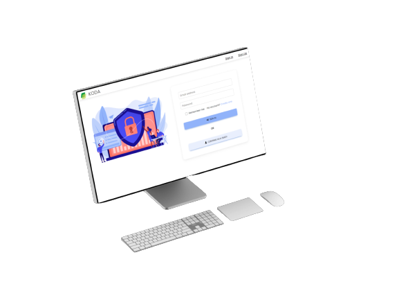

#  KODA - Secure secret exchange
### Il codice di questo progetto non è fornito in quanto confidenziale
 

**Web app per lo scambio sicuro di segreti e messaggi**. In particolare tutta la sessione verà gestita in modo *`effimero`*, quindi al suo termine ogni traccia verà cancellata.

##  Cosa fa?
KODA si occupa di fornire in primo luogo un ambiente sicuro dove le due parti possono connettersi senza dover preoccuparsi di attacchi Man-in-the-middle o Crittoanalisi.
Per garantire ciò è richiesta l'autenticazione da entrambe le parti tramite login o creazione di un account qual'ora non si fosse in possesso di uno

  
  

infine la cifratura dei segreti e messaggi viene effettuata in due modalità: per prima cosa viene generata una coppia di chiavi effimera per utente tramite **Diffie-Hellman**;
poi seguendo il principio di questo algoritmo le due parti computano localmente la chiave di sessione simmetrica che verrà data in pasto, assieme al segreto o messaggio, all'algoritmo di cifratura simmetrico **AES-128**.

per utilizzare l'app:
###  `npm start`

Runs the app in the development mode.\

Open [http://localhost:3000](http://localhost:3000) to view it in your browser.

###  `npm test`

Launches the test runner in the interactive watch mode.\

See the section about [running tests](https://facebook.github.io/create-react-app/docs/running-tests) for more information.

  

###  `npm run build`

Builds the app for production to the `build` folder.\

It correctly bundles React in production mode and optimizes the build for the best performance.

###  `Comandi utili in-app`
*`/hide`*: Comando che nasconde il segreto inserito in fase di visualizzazione e tramite toggle (eye) da la possibilità di leggerlo.  
*`/qr`*: Comando che genera un QR code con valore uguale al segreto inserito. Il destinatario scansionandolo ha la possibilità di recuperare il segreto.

##  Sviluppato con

KODA è una Web app sviluppata in Javascript per il back-end e in React per il front-end, usando anche librerie e programmi esterni:
* [React](https://react.dev/)
* [Javascript](https://www.javascript.com/)
* [Firebase](https://firebase.google.com/)
* [Bootstrap 5](https://getbootstrap.com/docs/5.0/getting-started/introduction/)
* [Material Design](https://m3.material.io/)

You can learn more in the [Create React App documentation](https://react.dev/).
To learn React, check out the [React documentation](https://reactjs.org/).

  

##  Prerequisiti per usare l'app
ReactJS richiede l'installazione di Node.js, un ambiente di runtime JavaScript, insieme a npm (Node Package Manager), che viene fornito con Node.js. Puoi scaricare Node.js dal sito ufficiale e viene fornito con npm. [NodeJS](https://nodejs.org/en)

## Note
Progetto di tesi di Cristian De Nicola.
